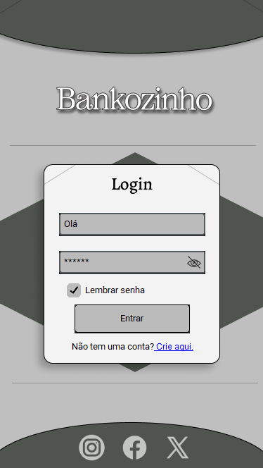

# 🏦 Aplicativo Bancário com CustomTkinter

Este projeto é uma interface gráfica para simular um sistema bancário, desenvolvida em **Python** com a biblioteca **CustomTkinter**, com um visual moderno, responsivo e com navegação otimizada entre telas utilizando **frames**. A aplicação atualmente inclui uma tela de login e uma de cadastro estilizadas, com campos personalizados, imagem de fundo, alternância de senha e integração visual com a identidade "Bankozinho".

---

## 📸 Preview

> Exemplo de interface da tela de login:



---

## 📁 Estrutura do Projeto

```
Aplicativo_Banco/
├── example/
│   ├──exemplo_login.png
├── images/                   # Imagens utilizadas na interface
│   ├── cadastro.png
│   ├── eye_closed.png
│   ├── eye_open.png
│   ├── icon.ico              # Ícone da aplicação
│   └── login.png
├── login.py                  # Tela de login
├── cadastro.py               # Tela de cadastro 
├── main.py                   # Arquivo principal que inicia o app
├── principal.py              # Tela principal
├── requirements.txt          # Dependências do projeto
└── README.md                 # Documentação do projeto
```

---

## ✅ Funcionalidades

- [x] Tela de login com imagem de fundo
- [x] Campos personalizados para usuário e senha
- [x] Botão para mostrar/ocultar senha com ícone
- [x] Caixa de seleção "Lembrar senha"
- [x] Link clicável para cadastro de novo usuário
- [x] Tela de cadastro com mesmo estilo visual
- [x] Logo personalizada na janela (.ico)
- [x] Interface responsiva com tema moderno

---

## 🛠 Tecnologias Utilizadas

- [Python 3.x](https://www.python.org/)
- [CustomTkinter](https://github.com/TomSchimansky/CustomTkinter)
- [Pillow](https://pillow.readthedocs.io/)
- [bcrypt](https://pypi.org/project/bcrypt/)

---

## 🚀 Como Executar o Projeto

1. **Clone o repositório:**

```bash
git clone https://github.com/seu-usuario/Aplicativo_Banco.git
cd Aplicativo_Banco
```

2. **(Opcional) Crie e ative um ambiente virtual:**

```bash
# Windows
python -m venv venv
venv\Scripts\activate

# macOS/Linux
python3 -m venv venv
source venv/bin/activate
```

3. **Instale as dependências:**

```bash
pip install -r requirements.txt
```

4. **Execute a aplicação:**

```bash
python main.py
```

---

## 📦 Requirements

O arquivo `requirements.txt` contém as seguintes dependências:

```
customtkinter
csv
os
bcrypt
Pillow
```

Você pode gerar novamente com:

```bash
pip freeze > requirements.txt
```

---

## 🧠 Próximos Passos

- [ ] Integração com banco de dados (SQLite)
- [ ] Validação real de login com usuários cadastrados
- [ ] Criptografar e armazenar senhas com segurança
- [ ] Tela principal com funcionalidades bancárias (saldo, extrato, transferências)
- [ ] Lembrar usuário logado
